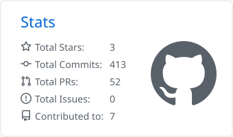
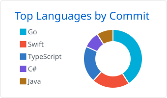

<h1 align="center">Hi, I'm Kathir 👋</h1>

<p align="center">
  <b>Photographer first. I write code to make media work faster.</b><br>
  Texas · sports and event photography · macOS tools
</p>

<p align="center">
  <a href="https://kathirdev.com"></a>
  <a href="https://www.instagram.com/kdev.photography/"></a>
</p>

---

### About me

- 📸 Media is the main thing. I shoot sports and events under [@kdev.photography](https://www.instagram.com/kdev.photography/).
- 💻 Computer science is what I enjoy, and I use it as a tool. Most of what I build exists because some part of making media was slower than it needed to be.
- 🔭 Right now I'm building **[Firstcut](https://github.com/Kathir-D/Firstcut)**, a RAW photo culler for Apple Silicon.

### What I'm building

| Project | What it does |
| --- | --- |
| 🚧 **[Firstcut](https://github.com/Kathir-D/Firstcut)** | A burst-aware RAW photo culler for macOS. A football game can be 1,500 RAW files, mostly 10–40 frame bursts. Firstcut splits the shoot into bursts so you can pick keepers from the keyboard without waiting for previews to load. *In development.* |
| 🎒 **[Stockroom](https://github.com/Kathir-D/Stockroom)** | Barcode-driven equipment checkout for a school media department. Scan an ID to sign in, scan a sticker to check gear in or out. Runs on one PC, no internet needed. |
| 🎧 **[Sonar](https://github.com/Kathir-D/Sonar)** | Spotify in the macOS menu bar with hybrid auto-pause. It pauses your music when another app makes sound and resumes it about 0.3 s after things go quiet. |
| 🫥 **[headless-spotify](https://github.com/Kathir-D/headless-spotify)** | Hides official Spotify from the Dock and Cmd-Tab while windows and AppleScript keep working. No Premium, no API key. Made to pair with Sonar. |

Sonar and headless-spotify install with Homebrew:

```sh
brew tap Kathir-D/tap
brew install --cask sonar
brew install kathir-d/tap/headless-spotify
```

### Tools I use

<p>
  
  
  
  
  
  
  
  
</p>

### GitHub stats

<p align="center">
  <picture>
    <source media="(prefers-color-scheme: dark)" srcset="profile-summary-card-output/github_dark/3-stats.svg">
    
  </picture>
  <picture>
    <source media="(prefers-color-scheme: dark)" srcset="profile-summary-card-output/github_dark/2-most-commit-language.svg">
    
  </picture>
</p>

<sub>Cards are regenerated daily by a GitHub Action (<a href="https://github.com/vn7n24fzkq/github-profile-summary-cards">github-profile-summary-cards</a>).</sub>
